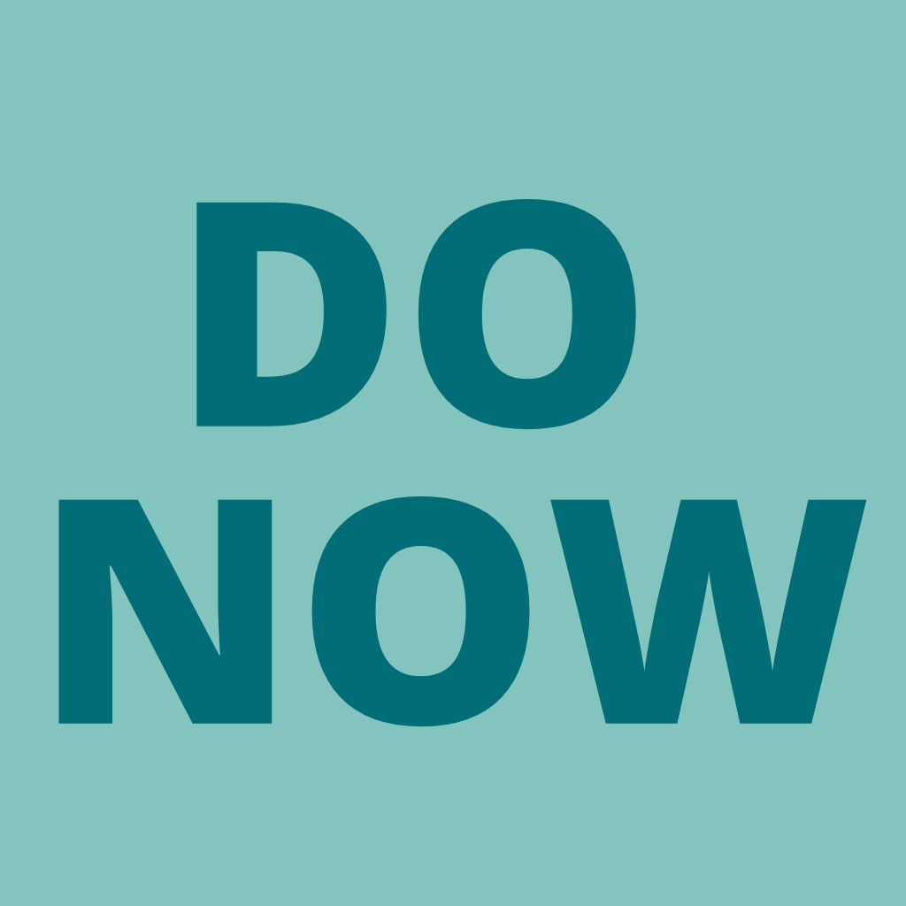
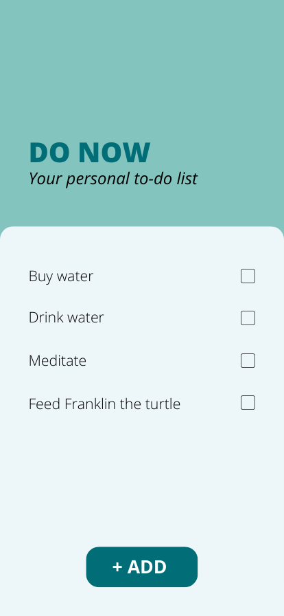
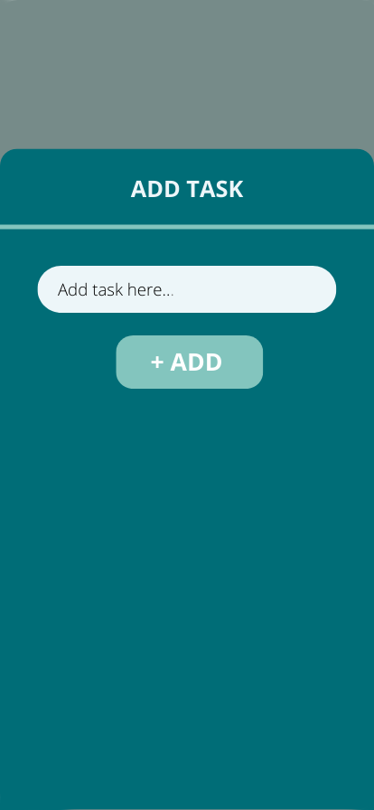
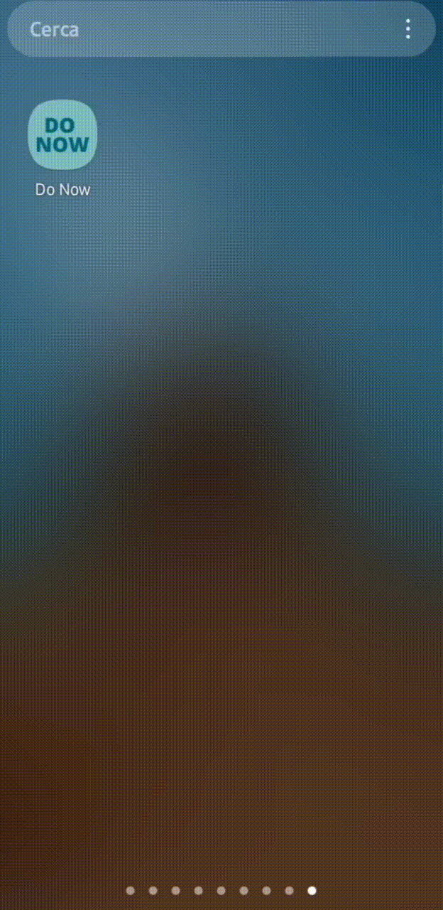

<h1>

&ensp;Do Now</h1>

 

## About this project
The Do Now project is the result of a
module called **Todoey** belonging to this amazing
<a href="https://www.udemy.com/course/flutter-bootcamp-with-dart/">
Flutter Development Bootcamp</a>.

For this project I modified the design from the beginning, creating the design model with Canva.

<table width="500px">
  <tr>
  <td width="250px" padding="10px"> </td>
  <td width="250px" padding="10px"></td>
  </tr>
</table>

##Final result

<table width="500px">
  <tr>
  <td width="250px" padding="10px"> </td>
  </tr>
</table>

 

## The project
The goal was to build a to-do list app to keep track of all your tasks. 
Tasks can be easily added, marked as done and deleted.

###Main features implemented developing the Do Now project:
- Provider package incorporation (*State management*)
- List Builder
- BottomSheet Widget

 

### Credits
>To know more about The App Brewery's courses visit <a href="https://www.appbrewery.co/">App Brewery</a>!
